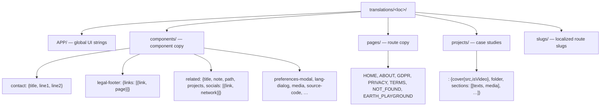

# Firebase data model

Root: `translations/<locale>/` for each of the 16 locales. `database.json` in
the repo is the source-of-truth snapshot baked into the bundle and synced to
Firebase.



## Node contracts

### `APP`

Flat-ish dict of global strings. Required subtrees: `about`, `actions`,
`contact`, `cookies`, `related`, `scrollup`, `title`, `preferences`,
`language`, `pref`, `carousel`, `statsHud` (`fps,cpu,gpu,net,lat,requests,mem,
engine{on,off,description}`), `earthPlayground`, `menu`, `close`, `loader`,
`engine`, `media`, `awards`, `sitePreferences`, `loading`, `notFound`.

### `components/related` (case-study footer)

```json
{
  "title": "Related projects",
  "note": "…disclaimer paragraph…",
  "path": "…",
  "projects": ["slug-a", "slug-b"],
  "socials": [{ "link": "https://…", "network": "GitHub" }]
}
```

CMS maps `note` ↔ "disclaimer". Writes must merge `path`/`projects` back.

### `components/legal-footer`

```json
{
  "links": [
    { "link": "/", "page": "Home" },
    { "link": "/privacy-policy", "page": "Privacy Policy" },
    { "link": "/gdpr", "page": "GDPR" },
    { "link": "/terms-of-use", "page": "Terms of Use" }
  ]
}
```

The label field is `page`, not `label`/`description`.

### `projects/<key>`

`sections` is an **array of `[texts, media]` tuples**:

```json
"sections": [
  [ { "title": "…", "text": "…" },
    [ { "src": "img-name", "isVideo": false, "size": [1920,1080], "label": "…" } ] ]
]
```

Media filenames carry **no extension**; consumers append the CDN suffixes
(`-mozjpg3-MSSIM-tuned-kodak.jpg`, `.mp4`, `.mp4.jpg-thumb.jpg`, …).

### `slugs`

```json
{
  "HOME": "home",
  "PROJECT": "portfolio",
  "PRIVACY": "privacy-policy",
  "GDPR": "gdpr",
  "TERMS": "terms-of-use",
  "EARTH_PLAYGROUND": "earth-playground"
}
```

Missing keys fall back to `LANG_SLUGS` defaults at merge time.

### `pages/EARTH_PLAYGROUND`

39 label keys — the complete panel vocabulary (camera, earth, terrain,
postFx, bloom, vignette, chromaticAb, filmGrain, color, debug, screenshot,
copyConstants, position, target …).

## Sync workflow

1. Edit `database.json` (or via CMS for content edits).
2. `yarn build` — Vite plugin emits per-locale snapshot chunks.
3. Push to Firebase: `firebase database:set /translations database-extract.json`
   (verified repo-is-newer before overwriting; live has no keys absent from
   the snapshot).
4. SWR contract: live `null` never wipes snapshot content; equality is
   order-insensitive.
