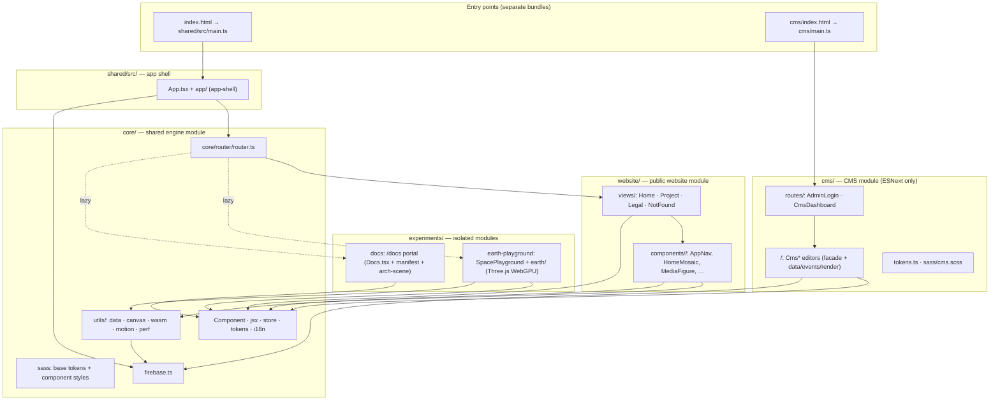

# Architecture

## Layers and ownership



### Import rules

| Layer                 | May import                    | Must NOT import                     |
| --------------------- | ----------------------------- | ----------------------------------- |
| `website/`            | `core/`                       | `cms/`, `experiments/`, other views |
| `cms/`                | `core/` (+firebase), own code | `website/`, `experiments/`          |
| `experiments/<area>/` | `core/`                       | `website/`, `cms/`, sibling areas   |
| `core/`               | `core/` internals only        | anything above it                   |
| `shared/src/` (shell) | every area                    | —                                   |

Each module carries its own `vite.config.js` (library build → `<module>/dist/`),
`tsconfig.json`, `jest.config.mjs` and `tests/` tree;
`shared/scripts/verify/scope-gates.mjs` runs typecheck, lint,
stylelint and the matching Jest slice per area — CMS skips a11y/Lighthouse
and `earth`/`docs` skip Lighthouse performance.

### Facade + module convention

Decomposed components follow one pattern everywhere: a **facade** at the
feature-folder root holds state, the public/test-visible method surface and
`customElements.define`, and delegates to same-named subfolder modules with
clean names — `components/portfolio/Related.tsx` + `related/{data,match,
render,types}.ts`, `utils/canvas/widgets/flag-webgl.ts` + `widgets/flag/{anim,gl,loop,…}.ts`,
`cms/about/CmsAboutEditor.tsx` + `about/{data,events,render,…}.ts`. Facade
methods stay as delegates so tests can spy on the original surface.

## Runtime shell

```
document
└── <app-shell>                shared/src/App.tsx   (shadow root, app.scss)
    ├── <app-nav>              components/nav/AppNav.tsx
    │     nav links, language button, burger canvas, WebGL menu backdrop
    ├── <main>                 router swaps route views here
    │     └── <home-view> | <project-view> | <legal-view> | <not-found-view>
    │           └── components → each is a BaseComponent with own shadow root
    ├── <stats-hud>            dev/perf overlay (opt-in via preferences)
    └── <cookie-banner>
```

Each `BaseComponent`:

1. Creates an open shadow root in `super(styles)` and inlines its compiled SCSS
   (`import styles from '../x.scss?inline'` → `<style>` inside the shadow root).
2. Renders via `h()` JSX into the shadow root.
3. Shows a skeleton placeholder (`.skeleton-layer` canvas or CSS shimmer)
   until `resolve()` is called with real data — see
   [webgl-canvas.md](webgl-canvas.md#skeletons).
4. Registers listeners through `addScopedListener` so teardown removes them
   automatically when the route changes.

## Two bundles

Vite builds two artifacts (see [build.md](../guides/build.md)):

- **Modern** (`target: es2026`) — served to evergreen browsers.
- **Compat** (`ecma: 2020`, separate `dist/assets/compat/`) — Safari-legacy path,
  selected at runtime by `safari-loader.ts`/`safari-patch.ts`.

The CMS has its own Rollup input (`cms/index.html`) inside the modern build, so
CMS code never enters the public entry graph and is excluded from indexing via
`robots` + `noindex` meta. The docs portal (`experiments/docs/`) is the
opposite: every manifest file is a crawlable `/docs/<root>/<path>` route —
`generateDocsSchema()` emits a `BreadcrumbList` + `TechArticle`/
`CollectionPage` JSON-LD graph per route, the JSX carries the matching
`itemscope`/`itemtype`/`itemprop` microdata, and `generate-sitemap.js`
enumerates the whole manifest into the English `public/meta/sitemap-en.xml`
(the root `sitemap.xml` is an index over per-locale `sitemap-<loc>.xml`
files; docs routes stay English-only).

## Data flow (read path)

```
build time                    runtime
─────────                     ─────────
database.json ──► snapshot    index.html → App.tsx
chunks (per   ──► instant     ├─► detectLangFromPath()
locale)         first paint   ├─► fetchFirebaseDb(components|APP|slugs)
                              │     ├─► stale: snapshot content renders now
                              │     └─► revalidate: live Firebase → onUpdate
                              │           (only if deep-different; null ≠ wipe)
                              └─► router mounts view → view fetches its
                                    pages/projects node → render → resolve()
```

A missing live node (`null`) never erases snapshot content — that was the fix
for the double-blink regression. The snapshot comparison is order-insensitive
because Firebase reorders object keys.
